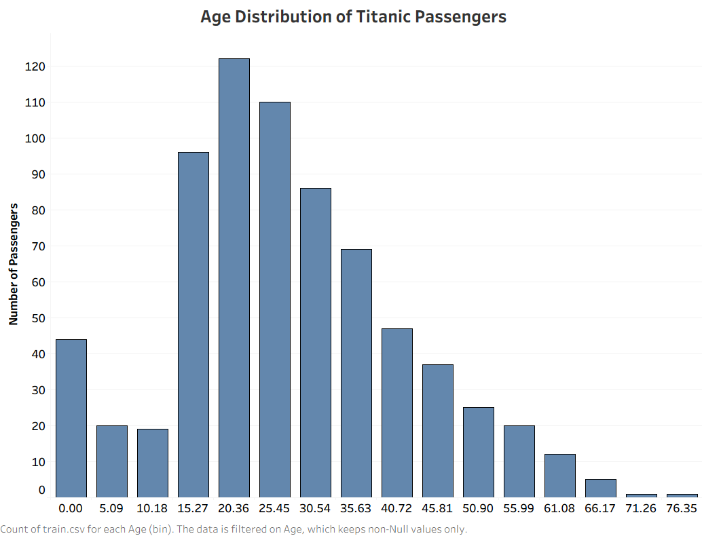

# SCT_DS_1 – Age Distribution Visualization

## 📌 Objective

Create a histogram to visualize the distribution of a continuous variable using Tableau.

## 📊 Project Overview

This project visualizes the **age distribution of Titanic passengers** using a histogram created in Tableau Desktop.

The passenger ages are grouped into intervals (bins), allowing the distribution of passengers across different age groups to be easily analyzed.

## 📈 Visualization

The histogram shows:

- **X-axis:** Age groups
- **Y-axis:** Number of passengers
- **Variable:** Passenger Age
- **Chart Type:** Histogram

## 💡 Key Insight

The visualization shows that the largest concentration of Titanic passengers was in the younger and young-adult age groups, with the number of passengers generally decreasing at older ages.

## 🛠️ Tools Used

- Tableau Desktop
- Titanic Dataset
- GitHub

## 📷 Visualization Preview

## 📂 Project Files

- [Tableau Workbook](SCT_DS_1_Titanic_Age_Distribution.twbx)
- [Dashboard Visualization](age_distribution.png)
- [Titanic Dataset](train.csv)